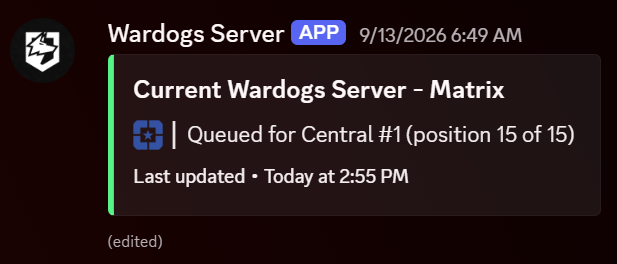
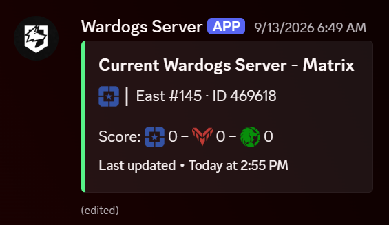

# Wardogs -> Discord status message

[](LICENSE)

Watches your screen for the `CURRENT SERVER` / `SERVER ID` text on the
Wardogs pause menu (Esc), and keeps a single Discord message updated with
it - the bot edits the same message in place rather than posting a new one
each time, so there's no notification spam and no rate-limit trouble
(message edits aren't subject to Discord's strict ~2-per-10-min channel
rename limit). Only runs OCR while `WardogsClient-Win64-Shipping.exe` is
actually running.

<p align="center">
  
  
</p>

## Prerequisites

1. **[Python 3.13](https://www.python.org/downloads/)** - during install,
   check **Add python.exe to PATH**. (Any recent Python 3 works; 3.13 is
   just what this was built/tested on.)
2. **[Tesseract OCR](https://github.com/UB-Mannheim/tesseract/wiki)** - grab
   the Windows installer from the "tesseract-ocr-w64-setup-*.exe" link.
   Install to the default location (`C:\Program Files\Tesseract-OCR`); if
   you put it somewhere else, set `TESSERACT_CMD` in `.env` (step 3) to the
   full path of `tesseract.exe`.
3. Install the Python packages this project needs: double-click
   [`install.bat`](install.bat) in this folder (a window opens, installs
   them, and tells you when it's done - press any key to close it). Or, from
   a terminal in this folder:
   ```bash
   pip install -r requirements.txt
   ```

## 1. Create a Discord bot

1. Go to https://discord.com/developers/applications and log in.
2. **New Application** -> give it a name (e.g. "Wardogs Status") -> Create.
3. Left sidebar -> **Bot**. Click **Reset Token** (or it's shown once on
   creation), copy it. Treat it like a password - anyone with it can control
   the bot.
4. No privileged intents need to be enabled - this bot never connects to the
   gateway, it only makes REST calls.
5. Left sidebar -> **OAuth2** -> **URL Generator**.
   - Scopes: check `bot`.
   - Bot permissions: check **Manage Channel** and **Send Messages**.
   - Copy the generated URL at the bottom, open it in your browser, pick your
     server, and authorize.

## 2. Create a read-only status channel

Make a text channel (e.g. `#current-wardogs-server`) that only the bot can
post in, so its one message is always the only thing there:

- Channel Settings -> **Permissions** -> `@everyone` -> deny **Send
  Messages**.
- Add the bot itself (search its name under Roles/Members) and explicitly
  **Allow**: View Channel, Manage Channel, Send Messages, Manage Messages,
  Read Message History. (In this server the bot's own base role only grants
  Manage Channels; giving it an explicit per-channel grant like this avoids
  relying on @everyone's permissions, which is more robust and was needed
  to work around a couple of undocumented Discord API quirks - voice
  channels specifically also required an explicit `Connect` grant for the
  bot, discovered while setting this up.)

Then get the channel ID: Discord -> User Settings -> **Advanced** -> enable
**Developer Mode**, then right-click the channel -> **Copy Channel ID**.

## 3. Configure the script

```bash
cd C:\path\to\wardogs-discord-status
copy .env.example .env
```

Open `.env` and fill in `DISCORD_BOT_TOKEN` and `DISCORD_STATUS_CHANNEL_ID`.

**`.gitignore` check:** `.env` holds your live bot token and must never be
committed - `.gitignore` already excludes it (along with `last_status.json`,
`wardogs_status.log`, and `__pycache__/`, none of which need to be tracked
either). Before committing anything, confirm it's actually being ignored:

```bash
git status              # .env should NOT appear under "Changes to be committed"
git check-ignore -v .env   # should print a line confirming .gitignore is catching it
```

If a change to `.gitignore` itself, or to what's staged, ever causes `.env`
to show up in `git status`, stop and fix that before committing - don't
push a commit that includes it. If it's already been committed, the fix is
more involved than just deleting it (it stays in git history) - regenerate
the token immediately and ask for help removing it from history.

## 4. Tune the capture regions (do this once, without touching Discord)

The script reads three boxes off your screen - `CAPTURE_REGION` (the OCR
crop), `TEAM_ICON_REGION` (the faction icon), and `SCORE_REGION` (the
scoreboard) - as fractions of one monitor. Run:

```bash
python region_preview.py
```

(or right-click the tray icon -> **Set capture regions...**) to open a
window with a screenshot of your monitor and all three boxes drawn on it.

- **Wrong monitor?** The dropdown lists every display by number and
  resolution. Pick the one Wardogs is actually on, then click **Use this
  monitor** to save that as `MONITOR_INDEX` in `.env`.
- **Get the game on screen.** Use **Capture in 5s**, then alt-tab into
  Wardogs within those 5 seconds and get to a state showing everything at
  once - sitting in the pause menu (Esc) during a match shows the server
  panel, team icon, and HUD scoreboard together.
- **Draw each box.** Pick a region with the radio buttons above the image
  (OCR capture region / Team icon region / Scoreboard region), then click
  and drag directly on the screenshot over the right part of the game's UI.
  It saves to `.env` immediately - no hand-editing fractions. Repeat for
  each of the three. **Reset to default** puts the selected one back to its
  original value if you want to start over.
- Restart the app afterward (tray icon -> Quit, relaunch) to actually apply
  whatever you changed - the preview window only ever reads/writes `.env`,
  it doesn't affect the running bot until it's restarted.

You can still hand-edit the fractions directly in `.env` if you'd rather
(`left,top,right,bottom`, each 0.0-1.0) - hit **Refresh** in the preview to
see those changes reflected.

**Then confirm with OCR.** Launch Wardogs, join a match, hit **Esc** so the
panel with `CURRENT SERVER` / `SERVER ID` is on screen, then in another
window run:

```bash
python wardogs_status_bot.py --once
```

This screenshots, OCRs, and prints both the raw OCR text and what it parsed
out - no Discord calls, no need for the game-running check to pass. If
`parsed status` is `None`:
- Check the raw OCR text - if it's empty or garbled, the crop region likely
  missed the panel. Adjust `CAPTURE_REGION` in `.env` (fractions of your
  screen: `left,top,right,bottom`) and re-run `--once` until the raw text
  clearly contains `CURRENT SERVER` and `SERVER ID`.
- If the raw text looks right but parsing still fails, the exact wording
  Discord OCR'd may differ slightly from what the regexes in
  `wardogs_status_bot.py` (`NAME_RE`, `ID_RE`, `REGION_RE`, `NUM_RE`) expect
  - tell me what the raw text says and I'll adjust them.

## 5. Run it

```bash
python wardogs_status_bot.py --dry-run
```

Play normally, pause with Esc occasionally - watch the console log the
status it *would* post/edit, without touching Discord. Once that looks
right, run it for real:

```bash
python wardogs_status_bot.py
```

Leave this running in a terminal in the background while you play. It only
does anything (screenshot/OCR) while Wardogs is running, and only touches
Discord when the parsed server actually changes AND has been read
identically twice in a row (debounced, so one flaky OCR pass can't trigger
a spurious update). State (last status + the message ID it's editing) is
tracked in `last_status.json`, so restarting the script won't create a
duplicate message.

It also re-sends the current status every `HEARTBEAT_INTERVAL_SECONDS`
(default 300 = 5 min) even when nothing has changed, purely to refresh the
embed's "Last updated" timestamp - so sitting on one server for a while
doesn't make the message look stale or make people think you're on an old
server. If the last real update was already older than that when the
script (re)starts, it refreshes immediately rather than waiting out a full
interval.

## 6. Run it in the background permanently (already set up)

`python wardogs_status_bot.py` with no flags shows a **system tray icon**
(the blue Wardogs emoji, bottom-right of the taskbar - it may be under the
`^` hidden-icons arrow the first time; drag it out to keep it always
visible) instead of a console window, and logs to `wardogs_status.log` in
this folder instead of the terminal, since there is no terminal when run
this way. Right-click the tray icon -> **Quit** to stop it.

A Task Scheduler task named **WardogsDiscordStatus** is already registered
to launch this automatically (hidden, via `pythonw.exe`) every time you log
into Windows - so under normal use you never need to run anything by hand.
Useful commands if you ever need them:

```powershell
Start-ScheduledTask -TaskName "WardogsDiscordStatus"   # start it now
Stop-ScheduledTask -TaskName "WardogsDiscordStatus"    # force-stop it
Unregister-ScheduledTask -TaskName "WardogsDiscordStatus" -Confirm:$false  # remove the auto-start entirely
```

If you ever move this folder, re-register the task pointing at the new
path (ask me to redo it, or open Task Scheduler -> find
`WardogsDiscordStatus` -> Properties -> Actions -> edit the path).

## 7. Multiple people

Anyone else who wants their own status message in the same channel needs
their own copy of this project, running on their own PC, with their own
`.env` - each install is fully independent: it has its own capture regions
(everyone's game resolution/UI scale is different), its own `MONITOR_INDEX`,
and its own `last_status.json`, so their message IDs never collide with
anyone else's even in the same channel. Set `DISPLAY_NAME` in their `.env`
to their own name (e.g. `DISPLAY_NAME=Ghost`) so the messages are
distinguishable - it shows up in the embed title and the not-in-game text.

To onboard a friend:

1. Send them this repo (it's private - add them as a GitHub collaborator,
   or zip the folder minus `.env`/`last_status.json`/`wardogs_status.log`,
   which are all machine-specific and gitignored anyway).
2. They set up **Prerequisites** above (Python, Tesseract, `pip install -r
   requirements.txt`).
3. They copy `.env.example` to `.env`, set `DISPLAY_NAME` to their own name,
   and fill in `DISCORD_STATUS_CHANNEL_ID` (same channel ID as you - copy it
   from your own `.env`).
4. **Bot token - two options:**
   - **Share your bot's token (simplest).** They use the exact same
     `DISCORD_BOT_TOKEN` you do. No extra Discord setup needed - your bot's
     existing permission overwrite in the channel (step 2 above) already
     covers it. The tradeoff: your token now lives on another person's
     machine, and anyone who has it can post as your bot / edit or delete
     anything it's posted, anywhere it has access. Fine for a small trusted
     group; regenerate the token in the Developer Portal if that ever stops
     being true (this revokes it for everyone using it, so all copies need
     the new one).
   - **Give them their own bot (more isolated).** They follow "1. Create a
     Discord bot" themselves to make their own bot application/token, then
     you add their bot to the channel's permission overwrites (step 2) the
     same way yours was added, so it can actually post there. More setup,
     but nobody's token but their own can act as their bot.
5. They run `python region_preview.py` to set `CAPTURE_REGION` /
   `TEAM_ICON_REGION` / `SCORE_REGION` / `MONITOR_INDEX` for their own
   screen (step 4 above), confirm with `--once`, then set up their own
   Task Scheduler entry the same way yours is set up (step 6 above - ask me
   to register it if they want the always-running/tray-icon setup).

Each person's message updates completely independently - no rate-limit or
notification interaction between them, since they're separate messages.

## Notes / limits

- The status format is `Region #N · ID ServerID` (e.g.
  `Central #12 · ID 509-791`), built in `parse_server()` in
  `wardogs_status_bot.py` - edit that function if you want a different
  format.
- While queued for a server (the "IN SERVER QUEUE... Position N of M" bar
  in the server browser), the status shows `Queued for Region #N (position
  X of Y)` instead - see `parse_queue()`. The queue's countdown timer is
  deliberately not included (it ticks every second, which would otherwise
  count as a status "change" on nearly every poll).
- While actually in a match, the icon shown is your faction's actual logo
  (Lonestar blue / Valkyra red / Manticore green - custom emoji re-uploaded
  from the official Wardogs Discord, same as the generic fallback icon),
  e.g. `🔴 │ Central #32 · ID 311496`. The faction name itself isn't
  repeated in the text - the icon already says which team. Detected by
  sampling the small team icon in the bottom-right HUD corner (color, not
  OCR text - see `detect_team()` and `TEAM_ICON_REGION`), independently of
  the server-info read: the team icon isn't visible while the pause menu
  is open (confirmed in practice), so `run_loop` tracks the last known
  server and last known team separately and combines them
  (`compose_status()`) - a team switch alone (e.g. via "Change Team," with
  no pause-menu reopen) is enough to trigger an update on its own. All
  three factions have been confirmed against live samples. If one ever
  misreads as the wrong team, tell me and I'll recalibrate
  `TEAM_HUE_DEGREES` / the pixel-count threshold in `detect_team()`.
- While in a match, the three team scores from the bottom-left scoreboard
  are shown under the server line (`Score: 🔵 5 – 🔴 13 – 🟢 95`, same
  blue-red-green order as the game, leading zeros dropped). Only the three
  large 3-digit numbers are read - not the team-size numbers beside the
  person icons. See `read_scores()` / `SCORE_REGION`: each of the three
  panels must OCR as exactly three digits or the whole read is discarded
  (so menus/map screens can't produce phantom scores), and a score must be
  read identically twice in a row before it's used. If the HUD is covered
  (full-screen map, etc.) the last confirmed scores stay up. Since scores
  tick up constantly, a score-only change is sent to Discord at most every
  `SCORE_UPDATE_INTERVAL_SECONDS` (default 30); server/team changes are
  never delayed. Scores reset when you change servers or leave the match.
- If Wardogs UI scaling/resolution changes, you may need to re-tune
  `CAPTURE_REGION` (step 4) and possibly `TEAM_ICON_REGION` / `SCORE_REGION` too - the
  preview from step 4 is the quickest way to see what needs to move.
- If you ever see 403 `Missing Access`/`Missing Permissions` errors again
  after changing channel permissions, it likely means a permission the bot
  needs got removed from its explicit per-member overwrite in step 2 -
  check that overwrite still has all five permissions listed there.
